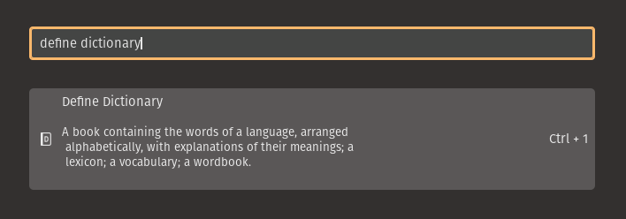

# A Dictionary for the Pop!_OS launcher

This brings together several resources that create an easy-to-use dictionary experience similar to Mac OS X. You can open the Pop Launcher and type "define XYZ" to show the definition of XYZ in multiple dictionaries.



## Install

```
/bin/bash -c "$(curl -fsSL https://raw.githubusercontent.com/shmink/pop-launcher-dictionary/master/install.sh)"
```


## Acknowledgments 

Thanks to canadaduane for [the idea and the basis of the project](https://github.com/canadaduane/pop-dictionary).

## Other Dictionaries

If you would like to add another dictionary for another language you can search for them with `sudo apt-cache search "dict-"` and then `sudo apt install [package name]`